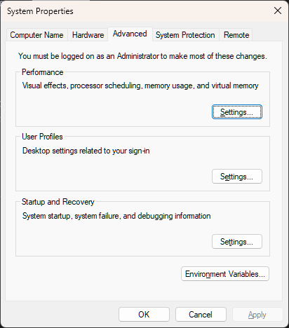
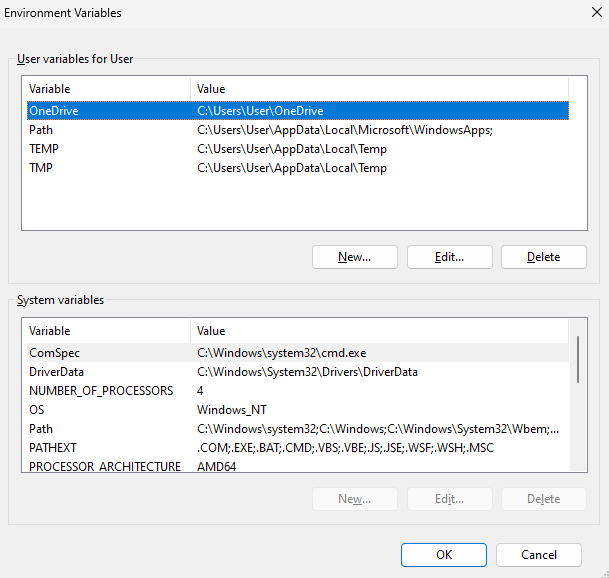

# Introduction

This book is intended as an unofficial user-guide for the *Prometheus* fire growth modelling software, specific to version 2023.06.01, as of June 1st, 2023. This is the End of Life (EOL) version and final officially released version of the software. In this book, we will cover breadth of topics related to *Prometheus*, with the goal of enabling broader usage of this tool and to catalogue the known but unwritten issues, bugs, errors, and outright confusing aspects of the software. *Prometheus* is and has been a valuable tool for Canadian wildland fire[^intro-1] managers since its initial release, and we expect that it will continue to be used many years into the future, despite newer and more impactful software being developed. However, it is also possible that *Prometheus* usage will entirely disappear in an operational and research context in the near future. In either case, it will be important to document and describe how this software functioned, how to use it, and most critically, how to resolve the myriad issues inherent to *Prometheus*.

[^intro-1]: While many terms, I choose to use wildland fire. Forest fire, brush fire, bush fire, wildfire, grass fire, whatever term you prefer, I am generally referring to that.

*Prometheus* is a deterministic wildland fire growth modelling software that is based around the *Canadian Forest Fire Danger Rating System (CFFDRS),* utilizing the *Fire Weather Index (FWI)* and the *Fire Behaviour Prediction (FBP)* systems to predict potential fire growth. This text will assume the reader is well-versed in the FWI and FBP systems with a broad understanding of both the limitations and inherent assumptions of the CFFDRS[^intro-2]. Some aspects of interpretation of *Prometheus*, weather, fire weather, and other related aspects will be present in this text, however we expect that all readers will have some baseline knowledge.

[^intro-2]: If you are unfamiliar with the CFFDRS and it's sub-systems FWI and FBP, we strongly suggest reading the background literature before proceeding with *Prometheus* usage. A thorough understanding will improve both results and your eventual work in fire growth modelling.

Specialized training in fire behaviour is **not** a requirement for using *Prometheus.* We encourage anyone with an interest in wildland fire to use and work with fire growth modelling software. While many aspects of *Prometheus* will feel more intuitive to those with prior training and experience in wildland fire, the basic concepts can be learned through a variety of resources, including *Prometheus* itself as a tool for learning about the CFFDRS.

*Prometheus* doesn't strictly require any coding or geospatial training or knowledge, but it is a definite benefit. Throughout this text, we will include code snippets and instructions that may rely on additional software and tools. These are *not* required, but greatly streamline the *Prometheus* workflow and better enable effective manipulation of the software itself.

We strongly suggest readers install and familiarize themselves with *R* and *QGIS*. Both are open-source and very powerful tools. We also recommend the use of *RStudio,* especially for individuals who are newer to programming in general. While we also recommend additional learning for both *R* and *QGIS*, we will provide code with instructions that the majority of readers will be able to use without prior knowledge.

*Prometheus* requires a variety of datasets to operate, with further additional data inputs that can improve and refine a model, but aren't strictly required. We will provide options for obtaining and/or creating necessary input data from open-access sources. Most of these sources will rely on national datasets from the Canadian Forest Service (CFS).

Lastly, while we call this a *user-guide* we also wish to emphasize that this guide is not intended to cover every single aspect, nor should one expect it to cover specific aspects of older file types. We will refer to the most common usage of files and file types in current use. For example, fuel type layers will be discussed in the **GeoTiff** format primarily.

# Installation & Set-up

*Prometheus* is free software that anyone can install with the correct computer. Obtain the necessary files here: <https://firegrowthmodel.ca/#/prometheus_software>. *Prometheus* can operate on most Windows based computers, with verified functionality on Windows Vista - Windows 11.

Please take some time to read this website, specifically the *Prometheus* software sections. Some useful documentation can be found under the Documentation page.

*Prometheus* can be run on the vast majority of personal computers and does not require a powerful workstation to function. Depending on what you aim to use the software for, the software may become less performant. Very complex fire simulations with heavy data will reduce software performance and can greatly overtax your computer. Be mindful of what you do; the software will run what you ask of it.

A few additional installations are required in advance of *Prometheus* set-up. A specific Intel Redist (which is a set of runtime library files) is required for *Prometheus* to function[^intro-3]. In addition, a Java Runtime is required (v1.8.0) and can be obtained here: <https://www.java.com/en/download/manual.jsp>

[^intro-3]: Intel hardware is **not** required for *Prometheus*, the Intel Redist is not hardware locked.

*Prometheus* requires a specific **Intel Redist version*.*** The software will not be installed without this and the user is required to ensure this is present on their machine. The correct version can be found on the firegrowthmodel.ca website currently. The required file is **Intel C++ runtime 2021.3.0.3372.**

This is a hard requirement. You cannot bypass this requirement and run *Prometheus*.

During installation of *Prometheus,* if either requirement is not found, the installation will not continue. It is also suggested that the user reboot their computer *after* installation of both the Java and Intel components and prior to completing *Prometheus* installation.

## Verify Path Settings

Post-installation, check and verify what path has been set for the *Prometheus* software. *Prometheus* has known conflicts, notably with other installations of GDAL, which can lead to frustrating and unclear issues. On a Windows machine, press the Windows key or the Windows icon to open the search bar. Type,\
"Environment" and two options should populate, "*Edit the system environment variables."* or *"Edit environment variables for your account."*

Administrative privileges may be required depending on your user/corporate settings to view and edit environment variables. You should see a window similar to this,

Select the **Environment Variables** option near the bottom right. A window similar to this should open,

In the **System Variables** section, look for the *Variable* `GDAL_DATA` first. The *Value* should be similar to,\
`C:\Program Files\Prometheus\gdal-data\`

Verify that this is correctly set. Next, search in the same list for the *Variable* `PROJ_LIB`. The *Value* should be similar to,

`C:\Program Files\Prometheus\proj_nad\`

Verify that this is correctly set. If so, *Prometheus* should be ready for useage.

### Troubleshooting Paths

In some cases, both `GDAL_DATA` and `PROJ_LIB` may point to other paths, such as an `OSGEO` installation as a part of QGIS. In order to properly utilize both *Prometheus* and other spatial software, the user may occasionally be required to re-direct the path destination directly.

# Input Data: Gathering and Formatting

At an absolute minimum, *Prometheus* requires a raster Fire Behaviour Prediction (FBP) Fuel Type (FT) input layer.
