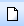
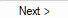
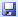
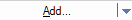
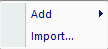

# Quick Start

This section is intended for quick reference on the steps required to initiate a new *Prometheus* project through to the outputs. This section assumes you already have properly formatted input data.

## Initial Set-up

This section covers the basic creation of a *Prometheus* project.

1.  Open *Prometheus*.
2.  Select either the `New`  button or `File -> New...`
3.  The New Project Wizard will open a dialogue box with various options. The `National default` is already pre-loaded for the Fuel Types.
4.  Click the `Next >`  button.
5.  This page will display options to input a `Fuel Type File` and an optional `Elevation File`. Select `Browse ...` and navigate to the location of your Fuel type file (and Elevation, if desired).
    i.  Note: format must be either ASCII (.asc), GeoTIFF (.tif, .tiff), or text (.txt).
    ii. Note: `NoData` ***must*** be set to `-9999` in the Fuel type file otherwise *Prometheus* will not load the fuel file.
6.  Click the `Finish` button and *Prometheus* will load in the data and initiate a new project.
7.  At this point, you should visually see the chosen Fuel Type layer displayed in *Prometheus'* map view.
8.  A `Components` window should be visible with a series of `Folder` icons .
    i.  Expand the Fuel Types folder to see the Fuel Types included in your layer and the associated colour mapping.
9.  Save your project at this step, using either the `Save`  button, `File -> Save As..`, or keyboard command `Ctrl + S`

## Weather & Ignition Data

This section covers the creation of a weather station, adding a weather stream, importing an ignition file, and manually drawing an ignition.

1.  Under the `Components` tab, right-click the `Weather Stations` folder and click the `Add ...` option.
    i.  A dialogue box will open.
    ii. Name your `Weather Station`.
    iii. Select your units under the `Location` section for the coordinates of your weather station.
         a.  Input your coordinates. Be sure to maintain the degree symbol (°[^quick-reference-1]) and/or the backtick (')
    iv. If you have input an `Elevation` grid and your `Weather Station` is located on the grid, the `Elevation` option will automatically calculate.
        a.  If your station is **not** on the grid or you did **not** provide an `Elevation` grid, the user can input the station elevation directly.
    v.  Select a display symbol, colour, and size if desired. Default is a size 3, blue circle.
    vi. Enter comments if desired. Otherwise, click the `OK` button to create the station.
2.  Save the project at this step.
3.  In the `Components` menu, expand the `Weather Stations` folder. The created station should be present here. Right-click the station and select the `Add Weather Stream...` option.
    i.  A dialogue box will open, the top will display some title based on your weather station such as `Weather Stream -Station`.
    ii. Enter a name for the `Weather Stream`, such as `Pine Station - RDPS - June 13-18-2020` to reflect the date, source of weather stream, and associated station.
    iii. Enter the `Starting Codes` obtained from `Daily FWI` in the relevant fields. The default in *Prometheus* will be `FFMC = 85`, `DMC = 6`, and `DC = 15`. These would reflect standard station-start up codes at the beginning of a season and must be adjusted to reflect your data.
         a.  If you do not have a formatted weather file with the correct fields, then set the correct `Start Date` in the upper right corner at this time.
         b.  If you have a formatted weather file, you can leave the `Start Date` alone as this will automatically adjust to your weather file datestamp.
    iv. Select your preferred method for `Hourly FFMC Calculation`.
    v.  Three primary options exist to create or import a weather stream at this stage.
        a.  `Import Weather...` 
            a.  Two options are possible here, `From file...` and `From ensemble...`
            b.  The `From file...` option is the only option that functions properly at present. It is unlikely this will change given *Prometheus* is end of life.
            c.  Select the `From file...` option and navigate to your *Prometheus* weather file[^quick-reference-2] (See the *Formatting* section for further details if required).
        b.  `Add...`  enables the user to manually enter weather data to create either a `Daily` or `Hourly` weather stream directly.
            a.  `Daily` option:
                a.  `Days to apply` this is how many days will be applied to create the weather stream based on the chosen input data. You can create either multiple days at once using the same Min/Max data *or* individually create days one (or more) at a time by repeatedly using the `Add... Daily` option.
                b.  Depending on how you've been provided your weather data, this may be the easiest option.
            b.  `Hourly` option:
                a.  You can manually input hour by hour weather to create an hourly weather stream through this option.
        c.  Once you have created or imported your weather stream, you can view it in the `Weather Conditions` table that is displayed in the `Weather Stream` dialogue box. Click `OK` once weather is properly added.
4.  Ignition Data Import and Creation
    i.  Under the `Components` tab, right-click the `Ignitions` folder
    ii.  `Add` enables the user to manually draw either a point, line, or polygon ignition directly in *Prometheus.* `Import...` allows the user to add an ignition file directly to the project that has been obtained / created elsewhere.
    iii. If `Add` is used, select your desired ignition type:
         a.  `Point` ignition will start your fire growth from a specific point (or points) on the landscape.
             1.  To add the `Point` left-click on a location in the map window and a red dot will appear.
             2.  You can add as many or as few points as desired throughout the grid.
             3.  Double left-click to finalize the points. A dialogue box will open.
             4.  Name the ignition and set a start-time. Be specific with the start-time as this is a necessary component in conjunction with your weather stream.
         b.  `Line` ignition will start your fire growth along the drawn line(s).
             1.  To add the `Line` ignition, left-click on an area of the map and then move your cursor to where you want the line segment to end. Either double left-click to finalize this line ignition or single left-click to start a new segment line.
             2.  A dialogue box will open. Name the ignition and mind the start-time.
         c.  `Polygon` ignition will start your fire growth along the *exterior* of the drawn polygon.
             1.  Similar to the `Line` ignition above but you will need to finalize the connection of your last segment to the starting segment to create the polygon.
             2.  Name the ignition and mind the start-time.
5.  Save your project.

[^quick-reference-1]: Hold the Alt key and type 0176 (Alt + 0176) to type the Degree symbol

[^quick-reference-2]: The most common method to obtain real-time weather files for usage in *Prometheus* is through the use of spotwx.com. You can directly obtain *Prometheus* formatted input files for many weather models here.

## Scenario Set-up

This section covers setting up a `Scenario` from which to produce a fire growth model output.

1.  Under the `Components` menu, select the `Scenarios` folder. An initial scenario will already exist in most cases. Either edit this or create a new scenario.
2.  A `Scenario` dialogue box will open with multiple tabs and windows within it.
    i.  `Scenario Inputs` is the main tab.
        a.  Set the `Start Time:` and `End Time:` for your scenario. These should reflect the correct dates and times you wish to simulate, i.e. `June 1, 2020 11:00` to `June 6, 2020 22:00`
        b.  In the `Ignitions` window, use the check box to select the ignitions you wish to model. You can add more than one.
        c.  If you have added `Fuel Breaks` you can activate those here.
        d.  If you have added `Grid and Patches` you can activate those here at your discretion.
        e.  Select your `Weather Stream`. We will return to this.
    ii. `Burning Conditions` tab offers the user the ability to set under what conditions a fire can grow in the model.
        a.  The amount of rows will correspond to the total number of days you added in the above `Start Time:` and `End Time:` options (in our example, there would be six rows)
        b.  `Start Time` under the `Burning Conditions` tab refers to the time at which a fire is enabled to spread on a given day.
        c.  `End Time` under the `Burning Conditions` tab refers to the latest time at which a fire is enabled to spread on a given day.
        d.  `HISI >` allows a user to define a threshold for `Initial Spread Index` at which a fire will begin spreading.
            a.  For example, `HISI >` set to a value of 5 means that a fire will *not* grow under any circumstances where the Hourly Initial Spread Index (`HISI`) is below 5.
        e.  `HFWI >` allows a user to define a threshold for `Fire Weather Index` at which a fire will begin spreading.
            a.  For example, `HFWI >` set to a value of 15 means that a fire will *not* grow under any circumstances where the Hourly Initial Spread Index (`HFWI`) is below 15.
        f.  `WS >` allows a user to define a threshold for `Wind Speed` at which a fire will begin spreading.
            a.  For example, `WS >` set to a value of 10 means that a fire will *not* grow under any circumstance when the `Wind Speed` is less than 10km/hr.
        g.  `RH <` allows a user to define a threshold for `Relative Humidity`, at which a fire will begin spreading.
            a.  For example, `RH <` set to a value of 60 means that a fire will *not* grow unless the `Relative Humidity` is lower than 60.
    iii. `Fire Weather` tab offers the user the option to interpolate `Fire Weather` spatially. Three options exist. If you enable `Fire Weather Interpolation` you will need to return to `Scenario Inputs` tab and identify a primary weather stream.
    iv. `Fire Behaviour` tab provides several options to refine various fire behaviour aspects.
        i.  `FMC (%) override:` this adjusts the Foliar Moisture Content threshold.
        ii. `Terrain effect` tells *Prometheus* to consider topography provided for wind.
        iii. `Breaching` enables fire to breach `Fuel Breaks` if enabled and a fuel break is provided.
        iv. `Spotting` does nothing and should not be available to enable/disable.
        v.  `Percentile rate of spread:` ???
        vi. `Green-up` allows the user to set the `Start Date:` and `End Date` periods for where the model should use the `Green` fuel type models.
        vii. `Standing Grass` allows the user to set the `Start Date` and `End Date` for where the model should use `Standing` versus `Matted` grass models.
        viii. `Grass Curing` section allows a user to set the `Degree of Curing (%)` across the grid. It further enables the user to dynamically set dates for curing over time.
    v.  `Propagation` tab provides several additional options that affect model performance and outputs.
        i.  `Display interval` will default to `01:00:00` but this can be adjusted at the user discretion. an interval of `01:00:00` will display fire growth every hour. Can be lowered or increased depending on desire.
        ii. `Maximum time step during acceleration:` defaults to `00:02:00` which is a two-minute interval time step. This is rarely needed to be adjusted.
        iii. `Stop fire spread at data boundary` will stop your fire from "spreading" beyond the extent of the fuel data.
        iv. `Purge non-displayable time steps` ???
        v.  `Fire may grow with independent time steps` useful for when you have multiple ignitions in one scenario.
    vi. Once all settings are set and verified, click `OK`.
    vii. Save your project.
    viii. You are now ready to `Run` the model!
